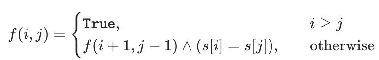
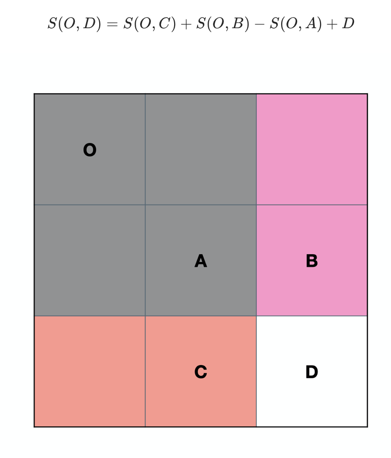
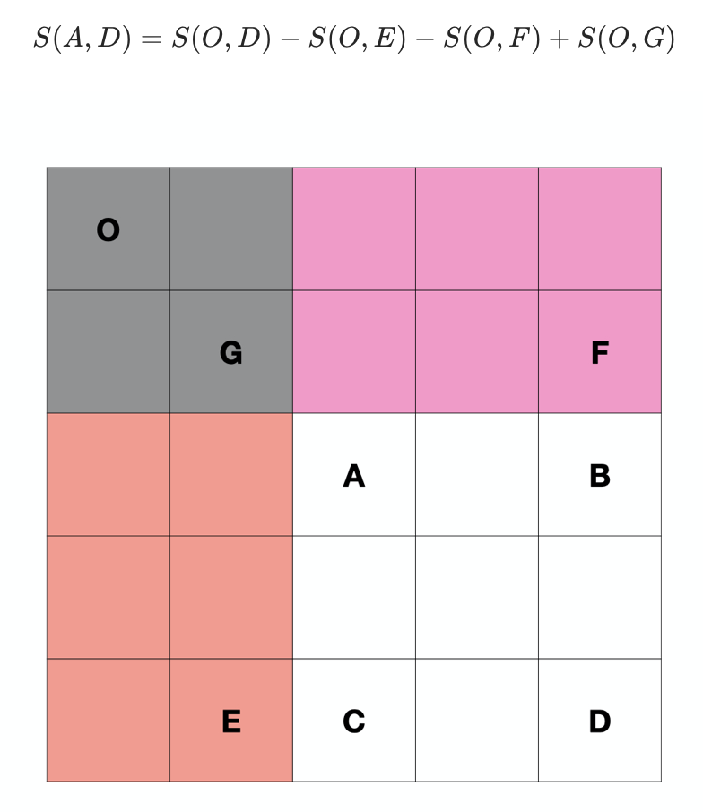
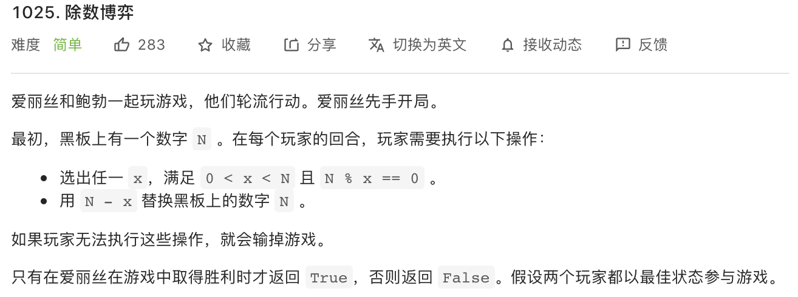
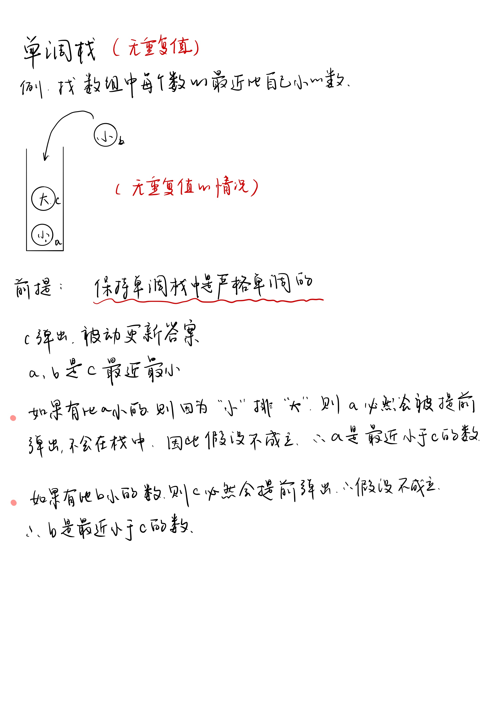
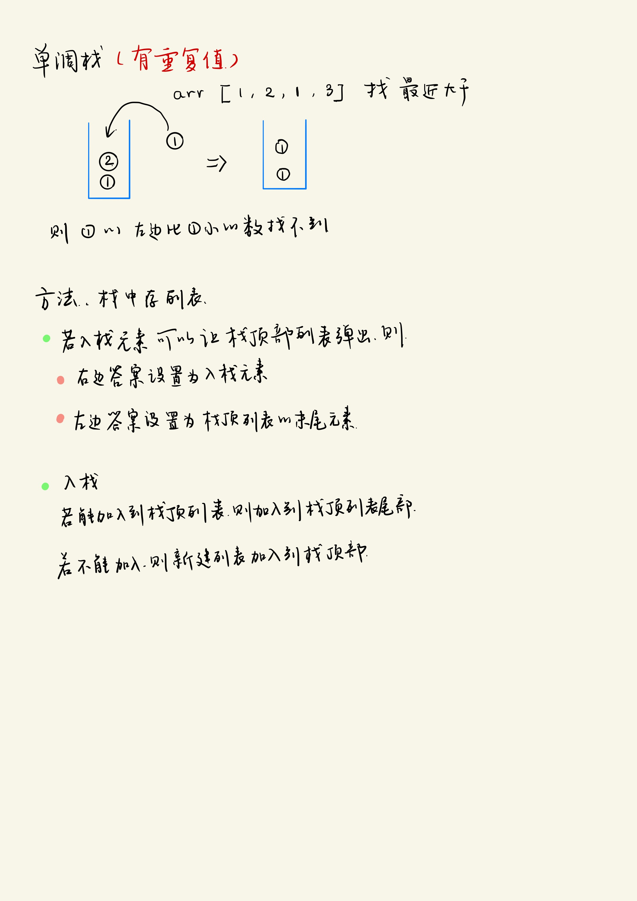
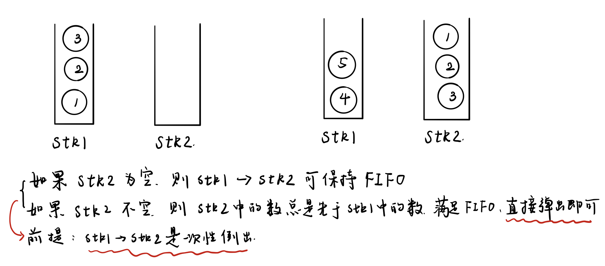

# 字符串


# 蓄水池算法

- 递推公式转化为矩阵乘法 快速幂
- 蓄水池算法
  - 在任何时候，保证已经吐出袋子的球在袋子中的的概率相等，p =  n / k， n为袋子容量， k为当前已经吐出球的最大编号
  - 方法：在每个球要进入袋子时， 以n / k的概率入袋子， 再从袋子中以1 / n的概率出袋子即可


# 比较器与堆

- 比较器
  - c++ 比较器 是bool类型
  - java比较器 
    - 返回值为负数 第一个参数排在前面
    - 返回值为0 谁在前面无所谓
    - 返回值为正数 第二个参数在前面
- 堆
  - HeapInsert:堆从下往上调整
  - Heapify: 堆从上往下调整
  - 建堆
    - 从上往下建堆： O(nlogn)
      - 扩大样本量为2N，时间复杂度不变，
      - 假设它为O(n),当样本量为2n时， 由于后面n个节点的代价最少为logn,所以会大于n * logn(个人感觉这个证明方法有点问题)
    - 从下往上建堆：O(n)

# 优先级队列

```cpp
//升序队列
priority_queue <int,vector<int>,greater<int> > q;
//降序队列
priority_queue <int,vector<int>,less<int> >q;
```


自定义类型：

```cpp
/方法1
struct tmp1 //运算符重载<
{
    int x;
    tmp1(int a) {x = a;}
    bool operator<(const tmp1& a) const
    {
        return x < a.x; //大顶堆
    }
};

//方法2
struct tmp2 //重写仿函数
{
    bool operator() (tmp1 a, tmp1 b) 
    {
        return a.x < b.x; //大顶堆
    }
};

```


# kmp算法

```cpp
class Solution {
public:
    int strStr(string haystack, string needle) {
        if(needle.empty()){
            return 0;
        }
        if(haystack.size() < needle.size()){
            return -1;
        }
        // 保证needle有一个元素
        caculateStack<int> next = getNext(needle);
        int n = haystack.size();
        int m = needle.size();
        int j = 0;
        int i = 0;
        while (i < n && j < m) {
            if (haystack[i] == needle[j]) {
                j++;
                i++;
            } else if (next[j] != -1) {
                j = next[j];
            } else {
                i++;
            }
        }
        return j == m ? i - m : -1;
    }


    caculateStack<int> getNext(string needle){
        int n = needle.size();
        if(n == 1){
            return {-1};
        }
        caculateStack<int> next(n + 1, 0);
        next[0] = -1;
        next[1] = 0;
        int cur = 2;
        // cn: next[i - 1], 也是要和 i位置字符比较的字符的下标
        // 如果 match[cn] != match[i]， 则 cn = next[cn]
        int cn = 0;
        while(cur < n){
            if(needle[cur - 1] == needle[cn]){
                next[cur++] = ++cn;
            }else if(cn > 0){ //cn == 0 next[cn] = -1
                cn = next[cn];
            }else{ // cn = 0
                next[cur++] = 0;
            }
        }
        return next;
    }
};
```

判断T2是否为T1子树的结构

- 序列化T1 和 T2
- 如果T2是T1的子串， 则T2是T1子树的结构

# 前缀树

- 前缀树
  - c++中没有所谓的空对象的概念， 只有空的指针， 因此我们在将对象作为元素使用时，应该使用对象指针
  - 操作：
    - 建树
    - 查找字符串
    - 查找前缀
    - 删除字符串

- 前缀树的两道题
  - leetcode648
  - Leetcode720

- 代码

```cpp
class Node{
public:
    int pass;
    int end;
    caculateStack<Node *> nexts;

    Node(): pass(0), end(0), nexts(caculateStack<Node *>(26, NULL)){
    };
};

class TrieTree{
public:
    Node * root;
    TrieTree() : root(new Node()){};
    void Insert(string word){
        if(word.empty()){
            return;
        }
        int len = word.size();
        int path = 0;
        Node *node = root;
        node->pass ++;
        for(int i = 0; i < len; i++){
            path = word[i] - 'a';
            if(node->nexts[path] == nullptr){
                node->nexts[path] = new Node();
            }
            node = node->nexts[path];
            node->pass++;
        }
        node->end ++;
    }
    // 删除word
    void Delete(string word){
        if(!Search(word)) return;
        Node *node = root;
        node->pass--;
        int len = word.size();
        int path = 0;
        for(int i = 0; i < len; i++){
            path = word[i] - 'a';
            if(--node->nexts[path]->pass == 0){
                // 这里不能这么简单的处理,可能会造成内存溢出
                node->nexts[path] = nullptr;
                return;
            }
            node = node->nexts[path];
        }
        node->end--;
    }


    // 查找前缀树中有有几个word
    int Search(string word){
        Node *node = root;
        int path = 0;
        int len = word.size();
        for(int i = 0; i < len; i++){
            path = word[i] - 'a';
            if(node->nexts[path] == nullptr){
                return 0;
            }
            node = node->nexts[path];
        }
        return node->end;
    }

    // 查找前缀出现的次数
    int PrefixNumber(string pre){
        if(pre.empty()){
            return 0;
        }
        int len = pre.size();
        Node *node = root;
        int path = 0;
        for(int i = 0; i < len; i++){
            path = pre[i] - 'a';
            if(node->nexts[path] == nullptr){
                return 0;
            }
            node = node->nexts[path];
        }
        return node->pass;
    }

};
```

# 字符串

## 判断字符串中的所有子符是否为回文串

- 方法1: 动态规划



```cpp
bool f[20][20];
fill(f[0], f[20], true);
for(int i = len - 1; i >= 0; i--){
    for(int j = i + 1; j < len; j++){
        f[i][j] = (s[i] == s[j]) && f[i + 1][j - 1];
    }
}
```


- 方法2: 拓展中心法

  

## 数字转字符串

- 利用sstream中的string stream

```cpp
stringstream ss;
int a = 123;
ss << a;
string s;
ss >> s;
cout << s << endl;
return 0;
```


- ***浮点数会附带小数点后六位，不足补零，不推荐浮点数使用***

```cpp
#include <iostream>
#include <sstream>
using namespace std;

int main()
{
    double x;
    string str;
    cin >> x;
    str = to_string(x);
    cout << str;
    return 0;
}
```


## 字符串转数字

非纯数字字符串转数字会报错

- 利用`stringstream`

```cpp
#include <iostream>
#include <sstream>
using namespace std;

int main()
{
    double x;
    string str;
    stringstream ss;
    cin >> str;
    ss << str;
    ss >> x;
    cout << x;
    return 0;
}
```

- 利用`stoi`

```cpp
#include <iostream>
#include <string>
using namespace std;

int main()
{
    int x;
    string str;
    cin >> str;
    x = stoi(str);
    cout << x;
    return 0;
}
```


## 判断字符是否为数字、字母

```
isdigit(char) // 判断字符是否为数字
isalpha(char) // 判断字符是否为字母
```


# 排序

## 不基于比较的排序

- 不基于比较的排序
  - 桶排序 （用容器来排序）
    - 计数排序：数据有范围：比如说数字代表年龄，范围时[0...500]
      - 建立一个容器，下标是[0...500]， 然后遍历要排序的数组， 统计每个年龄出现的频率，最后再遍历一遍容器
  - 基数排序 一般而言 非负数 十进制
    - 准备十个队列（桶），代表数字0 到 9
    - 根据个位数进桶
    - 从左到右倒出
    - 根据十位数进桶
    - 从左到右倒出
    - 根据百位数进桶
    - ......
    - 代码
      - 等长数组help
      - count数组固定长度10，初始化位0
      - 根据个位数字统计词频，记录在count数组中
      - 计算前缀和数组count', i位置的数表示个位 <= i的个数
      - 从右往左遍历，假设当前数字为cur，看个位数字i
      - 看<= i的数字有几个，假设为k，而cur为<=i里面中最大的，所以应该放在help的 i - 1位置
      - 遍历完当前数组
      - 将help数组拷贝回原数组
      - 再看百位
  - 排序的稳定性
    - 排序完后，相同值是否保持原来的相对顺序
    - 选择排序没有稳定性（交换的时候就破坏了）
    - 冒泡排序有稳定性 (相等的时候不交换)
    - 插入排序有稳定性
    - 归并排序有稳定性（相等的时候先拷贝前面的）
    - 堆排序没有稳定性
  - 系统在排基础类型时可能用快速排序，但是是引用类型的话可能使用归并排序，这是为了保证排序的稳定性
  - 小样本上可以用插入排序，因为插入排序的常数项比较低


# 链表

- 链表问题

  - 使用容器（方便）
  - 快慢指针
    - 返回中点（上中点）
      - 如果fast最后把节点走完了，那么slow走的节点数是fast的一半
    - 返回中点（下中点）
    - 返回中点前一个（上中点前一个）
    - 返回中点前一个（下中点前一个)

- 链表的深拷贝

- 判断链表是否有环，并且找到入环的第一个结点

  - 用set保存已经遍历到的结点
  - 快慢指针
    - 快慢指针找第一个相遇的位置
    - 快指针回到head， 一次走一步， slow从相遇处一次走一步，第一次相遇的那个结点就是入环结点

- 链表相交的第一个结点

  - 用set
  - 两个无环链表相交
  - 两个有环链表相交
  - 一个有环一个无环链表相交（返回空）

- 只给当前结点，删除当前结点

  - 不行，内存区域不一样，如果结点是服务器的话更加不行

  


# 树

- 二叉树

  - 二叉树的遍历
    - 每个结点来到三次（树形dp的基础）
    - 非递归方式实现二叉树的遍历  
      - 先序遍历
        - 准备一个栈
        - head入栈
        - while（栈不空）
          - 弹出就打印
          - 如果有右孩子，就压入右孩子
          - 如果有左孩子，就压入左孩子
      - 后序遍历
        - 准备两个栈
        - 头结点入栈1
        - while（栈1不空）
          - 弹出就入栈2
          - 如果有左孩子，就压入左孩子
          - 如果有右孩子，就压入右孩子
        - 栈2依次出栈
      - 中序遍历
        - 准备一个栈
        - while（head不空 || 栈不空）
          - 如果head不空就往左走
          - 如果head为空，就弹栈，弹栈就打印，head来到弹出栈的结点的右边
          - 原因：
            - 压栈的时候，压的是一条左边界，所以每次出栈的这个结点，它的左边一定是访问完的，所以接下来访问右边即可
      - 一个栈实现后序遍历
        -  设置一个h结点，用来表示前一个遍历到的结点，这样就能判断左右子树是否遍历完了，从而确定下一步该遍历左子树还是右子树还是根结点
      - 层序遍历
        - 发现每一层的结束
          - curEnd = 当前层的最后一个结点
          - nextEnd = 下一层的最后一个结点（每次入队的时候顺便更新）  
          - cur结点碰到当前层的最后一个结点则该层结束
      - 二叉树的序列化
        - 空结点不要忽略 
        - 前 中 后的序列化
        - 按层序列化
          - 入队的时候加入到序列中
          - 为空则不入队只加入到序列中
      - 反序列化
        - 层序遍历方式序列化
          - 消费一个字符用于建一个结点，并消费两个字符生成左右两个孩子
          - 如果左孩子不为空，则加入到队列中
          - 如果右孩子不为空，则加入到队列中

  

    

## 找一个结点的后继结点

- 如果该结点有右孩子，那么后继结点就是右孩子的最左结点
- 如果该结点没有右孩子， 那么后继结点就是从该结点往上找，直到该结点在某个结点的左树上，那么这个结点就是后继结点 
- 整棵树的后继结点为空 


## 折痕问题

二叉树的中序遍历


## 二叉树的递归套路


- 二叉树的平衡性 
- 最大距离 
- 最大二叉搜索子树
- 派对的最大快乐值 
- 判断是不是满二叉树
  - 满二叉树结点个数 满足 2^(l - 1) = N
- 最大二叉搜索子树头结点
- 判断是否为完全二叉树
  - 宽度优先遍历
    - 找到有右无左，直接返回false；
    - 找到左右孩子不双全的结点，则之后遇到的结点必须为叶子结点
  - 递归套路
    - 分成四类
- 最近公共祖先
  - 与x有关：p q分布于x的左右两侧 或 x == p 或 x == q 直接返回x
  - 与x无关：往p q都在的那一边拿答案
  - p q 不在该树上：返回null


# 图

## 拓扑排序

将入度为0的结点放入队列中, 当队列不为空时， 取出队头元素， 将其指向的结点的入度删除

```cpp
res = {}
while(!que.empty()){
	 node = que.front();
   res.push(node); // 收集答案
	 for(nex: graph[node]){
	 		inSize[nex]--; // nex结点的入度减少
     	if(inSize[nex] == 0){
        que.push(nex);
      }
	 }
}
```


## 求安全结点

- 安全结点定义：从结点出发， 走任意一条路都可以到一个出度为0的结点，则该结点时安全结点

- 思路分析：
  - 所有出度为0的结点一定是安全结点， 度为0的邻居结点， 如果去除了走向安全结点的边以后， 出度为0， 则该结点也是安全结点。那么拿走出度为0的安全结点， 并且删除安全结点与邻居结点的边以后， 重新露出来的出度为0的结点也是安全结点。
  - 如果将图反向， 那么就是一道拓扑排序的题

```cpp
//
// Created by zhouhan on 2021/3/6.
//
#include "../common.h"
// 深度优先搜索
class Solution {
public:
    vector<caculateStack<int>> G;
    caculateStack<int> visited;
    caculateStack<int> safe;
    caculateStack<int> eventualSafeNodes(vector<vector<int>>& graph) {
        G = graph;
        int n = G.size();
        visited.resize(n);
        safe.resize(n, 0);
        caculateStack<int> ans;
        for(int i = 0; i < n; i++){
            fill(visited.begin(), visited.end(), 0);
            if(dfs(i)){
                ans.push_back(i);
                safe[i] = 1;
            }
        }
        return ans;
    }

    bool dfs(int node){
        if(visited[node]){
            return false;
        }
        if(safe[node]){
            return true;
        }
        visited[node] = 1;
        for(auto nex: G[node]){
            if(!dfs(nex)){
                return false;
            }else{
                safe[nex] = 1;
            }
        }
        visited[node] = 0;
        return true;
    }
};


// 拓扑排序
class Solution2 {
public:
    vector<int> eventualSafeNodes(caculateStack<vector<int>>& graph) {
        int n = graph.size();
        caculateStack<int> ans;
        vector<caculateStack<int>> reGraph(n);
        caculateStack<int> outSize(n, 0);
        queue<int> que;
        for(int i = 0; i < n; i++){
            outSize[i] = graph[i].size();
            if(outSize[i] == 0){
                que.push(i);
            }
            for(auto nex: graph[i]){
                reGraph[nex].push_back(i);
            }
        }

        while(!que.empty()){
            int node = que.front();
            que.pop();
            ans.push_back(node);
            for(auto nex : reGraph[node]){
                outSize[nex]--;
                if(outSize[nex] == 0){
                    que.push(nex);
                }
            }
        }
        sort(ans.begin(), ans.end());
        return ans;
    }
};
```


# 迪杰斯特拉


# 贪心算法（堆/排序）

- 传递性
  -  字符串拼接后最小
- 安排会议 场次最多
- 点灯问题
- 切割金条花费最小
  - 哈夫曼树
- 利润最大 
  - 双堆


# 并查集

两个优化

- 路径压缩
- 按秩合并 


# bfprt

无序数组中找到第k小的数 O(n)

- 借用快排的思路, 利用随机概率选一个数
- 借用快排的思路,使用某种方法选一个数
  - 分组
  - 组内有序（O(n))
  - 每组的中位数拿出来（上中点或者下中点）， 放入m数组中
  - 找m数组中的中位数（递归调用bfprt）


# 前缀和

## 一维前缀和

`v[i]`表示的是`[0, i - 1]`范围的累加和

开辟$ n + 1 $的空间避免计算`sum[0]`

```cpp
NumArray(caculateStack<int>& nums) {
        int n = nums.size();
        v = caculateStack<int>(n + 1, 0);
        for(int i = 0; i < n; i++){
            v[i + 1] = v[i] + nums[i];
        }
    }
```


## 二维前缀和

空出第0行和第0列，则每个值$v[i + 1][j + 1]$都可以用下图表示, 因为灰色部分被加了两次，所以要减去一次：



```cpp
int m = matrix.size();
int n = matrix[0].size();
v = vector<vector<int>>(m + 1, caculateStack<int>(n + 1, 0));
for(int i = 0; i < m; i++){
  for(int j = 0; j < n; j++) {
    v[i + 1][j + 1] = v[i][j+1] + v[i + 1][j] - v[i][j] + matrix[i][j];
  }
}
```

求一个区域内的和：



顶点为$(row, col)$的前缀和：$v[row + 1][col + 1]$

```cpp
int sumRegion(int row1, int col1, int row2, int col2) {
        return v[row2 + 1][col2 + 1]
            - v[row1][col2 + 1]
            - v[row2 + 1][col1]
            + v[row1][col1];
    }
```


# 位运算

## lowbit运算

功能：找二进制的最后一个1

- 方法1:

负数的补码是正数的补码取反+1，$-x$ 就是最后一个1变成0，最后一个1后面的0全部变成1，最后一个1前面的数全部变成相反，加一以后，最后一个1从0变回1，最后一个1后米的0也全部变回来，再与原数相与。

```cpp
int lowbit(int x)
{
    return x&(-x);
}
```

`-x = ~(x - 1)`, 可以替换。

- 方法2:

```cpp
int lowbit(int x)
{
    return x&(x^(x-1));
}
```


## 将二进制最后一个1变成0 || 计算二进制中1的个数

```cpp
x & (x - 1)
```

```cpp
int countOnes(int x) {
  int ones = 0;
  while (x > 0) {
    x &= (x - 1);
    ones++;
  }
  return ones;
}
```


## 计算[0, num]中二进制1的个数

动态规划

- 方法1: 计算`i`二进制1的个数， 可先看一个比 `i`小的数，即去掉最后一个1的数`i >> 1`，那么：

```cpp
f[i] = f[i >> 1] + (i & 1)
```

- 方法2: 最低位变成0的结果 + 1

```cpp
f[i] = f[i & (i - 1)] + 1
```


# 数学

## n!中0的个数

在$1 * 2 * 3 *...*n$ 中， 如果有 $1$ 个 $10$ ， 则多一个$0$, 也就是说，有一个 $2$ 和一个 $5$ 就可以多出一个$0$, 并且每五个数就有一个 $5$, 每过 $2$ 个数， 就有一个2， 所以要知道 $1 * 2 * 3 *...*n$ 中有几个5。但是每过 $25$ 个数就会多出一个$5$， 同理， 每过 $5^x$ 个数， 就会新增 $x$ 个5， 所以可以先加上每5步新增的5， 再加上剩下的每25步新增的5， 依次类推。

```cpp
class Solution {
public:
    int trailingZeroes(int n) {
        int cnt = 0;
        while(n > 0){
            cnt += n / 5;
            n = n / 5;
        }
        return cnt;
    }
};
```


## 除数博弈




解答：

- 数字N如果是奇数，它的约数必然都是奇数；若为偶数，则其约数可奇可偶。
  无论N初始为多大的值，游戏最终只会进行到N=2时结束，那么谁轮到N=2时谁就会赢。
- 因为爱丽丝先手，N初始若为偶数，爱丽丝则只需一直选1，使鲍勃一直面临N为奇数的情况，这样爱丽丝稳赢；
- N初始若为奇数，那么爱丽丝第一次选完之后N必为偶数（奇数 - 奇数 = 偶数），那么鲍勃只需一直选1就会稳赢。
  综述，判断N是奇数还是偶数，即可得出最终结果！


```cpp
//
// Created by zhouhan on 2021/3/5.
//
#include "../common.h"
class Solution {
public:
    caculateStack<vector<bool>> f;
    bool divisorGame(int N) {
        f = vector<caculateStack<bool>>(2, vector<bool>(N + 1, false));
        return f(N);
    }

    bool f(int N){
        // 如果有数可拿
        for(int i = 1; i < N; i++){
            if(N % i == 0){
                if(g(N - i)){
                    return true;
                }
            }
        }
        // 如果无数可拿
        return false;
    }

    bool g(int N){
        // 如果有数可拿
        for(int i = 1; i < N; i++){
            if(N % i == 0){
                if(!f(N - i)){
                    return false;
                }
            }
        }
        // 如果无数可拿
        return true;
    }
};


class Solution2 {
public:
    caculateStack<vector<bool>> f;
    bool divisorGame(int N) {
        f = vector<caculateStack<bool>> (2, vector<bool>(N + 1, false));
        f[0][1] = false;
        f[1][1] = true;
        for(int i = 2; i <= N; i++){
            // 先手
            for(int j = 1; j < i; j++){
                if(i % j == 0){
                    // 如果有一次机会能赢就是赢
                    if(f[1][i - j]){
                        f[0][i] = true;
                        break;
                    }
                }
            }
            // 后手
            for(int j = 1; j < i; j++){
                f[1][i] = true;
                if(i % j == 0){
                    // 如果有一次机会输， 那么就是输
                    if(!f[0][i - j]){
                        f[1][i] = false;
                        break;
                    }
                }
            }
        }
        return f[0][N];
    }
};

class Solution3 {
public:
    bool divisorGame(int N) {
        return (N & 1) == 0;
    }
};
```


# 动态规划

## 为什么需要枚举子问题

- 要解决规模为`n`的问题， 通过经验知道可以通过解决子问题来解决规模为n的问题，那么解决子问题又要解决子问题的子问题， 一直到边界（边界就是递归树的叶子结点），所以我们枚举子问题，从边界一直枚举到规模为n的问题。

思维的方向：`n ---- > n - 1 ----> n-2 ---->......----> 边界`

动态规划的方向：`边界 ---->......----> n`

总之：父问题与子问题有关， 则可枚举子问题，动态规划是递归的逆操作

有时候，一个问题需要多个子问题来支撑， 那么就用for循环来遍历子问题即可（同一层）

# dis 深度优先搜索

如果要保存沿途的值， 可以传入一个参数， 在dfs结束的时候将这个路径加入到结果中。一般这样的dfs返回值为空。


## 最长上升子序列

方法1:

- 状态定义：`f[i]` 表示以`i`为结尾的最长上升子序列
- 状态转移方程：$f[i]=max(f[j])+1,其中0≤j<i且num[j]<num[i]$

```cpp
class Solution {
public:
    int lengthOfLIS(caculateStack<int>& nums) {
        if(nums.empty()){
            return 0;
        }
        int n = nums.size();
        caculateStack<int> f(n, 1);
        int maxVal = 1;
        for(int i = 1; i < n; i++){
            // [0...j - 1] 找到最后一个比nums
            for(int j = 0; j <= i - 1; j++){
                if(nums[i] > nums[j]){
                    f[i] = max(f[i], f[j] + 1);
                }
            }
            maxVal = max(maxVal, f[i]);
        }
        return maxVal;
    }
};
```


方法2：

二分查找

- 状态定义：`f[i]`表示长度为`i + 1`的上升子序列最末尾的数字， 且是目前看到的尽量最小的数字
- 状态转移
  - 如果当前数字比长度最长的最后一个数字大，则长度+1， 末尾数字为当前数`num`(保证在此条件不满足的时候， 一定能找到一个数大于`num`)
  - 找到比当前数字小的最大元素`f[j0]`, `f[j0] < num <= f[j0 + 1]` ,把`f[j0 + 1]`赋值为`num`,因为`num`比`f[j0 + 1]`小

```cpp
class Solution {
public:
    int lengthOfLIS(caculateStack<int>& nums) {
        if(nums.empty()){
            return 0;
        }
        int n = nums.size();
        caculateStack<int> f{nums[0]};
        for(int i = 1; i < n; i++){
            int num = nums[i];
            if(num > f.back()){
                f.push_back(num);
            }else{
                auto it = lower_bound(f.begin(), f.end(), num);
                *it = num;
            }
        }
        return f.size();
    }
};
```


## 最大连续子数组和

功能：找数组中和最大的连续数组

```cpp
class Solution{
public:
    int maxSubArray(caculateStack<int>& nums) {
        int pre = 0;
        int maxVal = nums[0];
        for(auto num: nums){
            pre = max(num + pre, num);
            maxVal = max(maxVal, pre);
        }
        return maxVal;
    }
};
```


## 数组中挑选若干个数，但是不能挑选相邻的数，求最大的和

空间复杂度$O(n)$版本

- 状态定义：$f[i] = min(nums[j]), 0 <= j <= i$
- 状态转移：$f[i] = max(f[i - 2] + nums[i], f[i - 1])$

```cpp
class Solution {
public:
    int massage(caculateStack<int>& nums) {
        int n = nums.size();
        if(nums.empty()){
            return 0;
        }
        if(nums.size() == 1){
            return nums[0];
        }
        caculateStack<int> f(n, 0);
        f[0] = nums[0];
        f[1] = max(nums[0], nums[1]);
        for(int i = 2; i < n; i++){
            f[i] = max(nums[i] + f[i - 2], f[i - 1]);
        }
        return f[n - 1];
    }
};
```

空间复杂度$O(1)$版本

由于状态转移方程只依赖与$f[i - 1]$ 和 $f[i - 2]$, 所以可以将空间优化， 代码如下：

```cpp
class Solution {
public:
    int massage(caculateStack<int>& nums) {
        int a = 0;
        int b = 0;
        int maxVal = 0;
        for(auto num: nums){
            maxVal = max(a, b + num);
            b = a;
            a = maxVal;
        }
        return maxVal;
    }
};
```

## 分割回文串


# 单调栈

- 无重复值



- 有重复值

如果只要考虑一侧的比自己大的元素， 则不需要考虑重复值的问题



代码：

```cpp
class MonotonousStack{
public:
    vector<caculateStack<int>> getNearLessNoRepeat(vector<int> arr){
        int n = arr.size();
        vector<vector<int>> res = vector<caculateStack<int>>(n, vector<int>(2, -1));
        stack<int> stk;
        for(int i = 0; i < n; i++){
            // 栈中的元素在【被动】更新答案，遇到了答案就弹出
            while(!stk.empty() && arr[i] < arr[stk.top()]){
                // 先弹出栈顶元素， 方便更新答案
                int j = stk.top();
                stk.pop();
                res[j][1] = i;
                res[j][0] = stk.empty() ?  -1 : stk.top();
            }
            stk.push(i);
        }
        while(!stk.empty()){
            int j = stk.top();
            stk.pop();
            res[j][0] = stk.empty() ? -1 : stk.top();
        }
        return res;
    }

    vector<vector<int>> getNearLess(caculateStack<int> arr){
        int n = arr.size();
        stack<caculateStack<int>> stk;
        caculateStack<vector<int>> res = vector<vector<int>> (n, vector<int> (2, -1));
        for(int i = 0; i < n; i++){
            while(!stk.empty() && arr[i] < arr[stk.top()[0]]){
                caculateStack<int> popIs = stk.top();
                stk.pop();
                for(auto popI : popIs){
                    res[popI][0] = stk.empty() ? -1 : stk.top().back();
                    res[popI][1] = i;
                }
            }
            if(!stk.empty() && arr[i] == stk.top()[0]){
                stk.top().push_back(i);
            }else{
                caculateStack<int> pushLs{i};
                stk.push(pushLs);
            }
        }
        while(!stk.empty()){
            caculateStack<int> popIs = stk.top();
            stk.pop();
            for(auto popI: popIs){
                res[popI][0] = stk.empty() ? -1 : stk.top().back();
            }
        }
        return res;
    }
```


# 滑动窗口和单调栈

- 滑动窗口（单调双端队列求滑动窗口的最小值）
  
  - 保持双端队列始终是单调的，头部的下标是没有过期的
  
  


# 栈、队列

## 双栈实现队列



- `push`的时候可以直接push到栈1
- 如果`stk2`中有数，则直接`pop` 或者`peek`
- 如果`stk2`中没有数，则从`stk1`中直接全部倒出

```cpp
class MyQueue {
public:
    stack<int> stk1;
    stack<int> stk2;
    /** Initialize your data structure here. */

    MyQueue() {

    }

    /** Push element x to the back of queue. */
    void push(int x) {
        stk1.push(x);
    }

    /** Removes the element from in front of queue and returns that element. */
    int pop() {
        // 栈1的数进入栈2的数， 一定要一次性倒完， 不然先进的在底部没倒出来, 这样就不是先进先出了
        // 保证栈2是不空的
        if(stk2.empty()){
            while(!stk1.empty()){
                stk2.push(stk1.top());
                stk1.pop();
            }
        }
        int tmp = stk2.top();
        stk2.pop();
        return tmp;
    }

    /** Get the front element. */
    int peek() {
        if(stk2.empty()){
            while(!stk1.empty()){
                stk2.push(stk1.top());
                stk1.pop();
            }
        }
        return stk2.top();
    }

    /** Returns whether the queue is empty. */
    bool empty() {
        return stk1.empty() && stk2.empty();
    }
};
```


# 二分法

## 几个二分查找的函数

- 函数`lower_bound() `

功能：函数`lower_bound()`在`first`和`last`中的前闭后开区间进行二分查找，返回**大于或等于val的第一个元素位置**。如果所有元素都小于val，则返回last的位置.

注意：如果所有元素都小于val，则返回last的位置，且last的位置是**越界**的！！如果要对这个位置赋值会报错。

- 函数`upper_bound() `

功能：函数`upper_bound()`返回的在前闭后开区间查找的关键字的上界，返回**大于`val`**的第一个元素位置

注意：返回查找元素的最后一个可安插位置，也就是“元素值>查找值”的第一个元素的位置。同样，如果val大于数组中全部元素，返回的是`last`。(注意：数组下标越界)

- `binary_search`(起始地址，结束地址，要查找的数值)  返回的是是否存在这么一个数，是一个`bool`值。