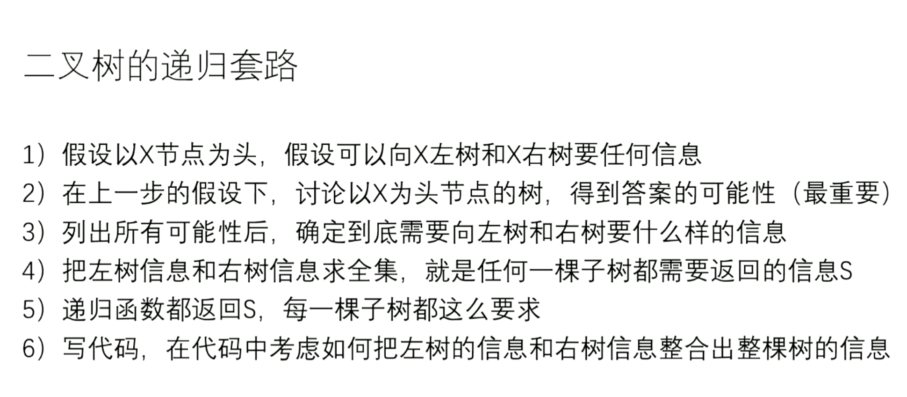

# 学习进度


## 2021-1-18

- 二分搜索 leetcode 540

## 2021-1-27

- 滑动窗口（单调双端队列求滑动窗口的最小值）
- 单调栈
  - 有重复值
  - 无重复值
- 求子数组和 ：前缀和数组


## 2021-1-28

- 三维动态规划 
- 递推公式转化为矩阵乘法 快速幂
- 蓄水池算法
  - 在任何时候，保证已经吐出袋子的球在袋子中的的概率相等，p =  n / k， n为袋子容量， k为当前已经吐出球的最大编号
  - 方法：在每个球要进入袋子时， 以n / k的概率入袋子， 再从袋子中以1 / n的概率出袋子即可

## 2021-1-29

- 比较器
  - c++ 比较器 是bool类型
  - java比较器 
    - 返回值为负数 第一个参数排在前面
    - 返回值为0 谁在前面无所谓
    - 返回值为正数 第二个参数在前面
- 堆
  - HeapInsert:堆从下往上调整
  - Heapify: 堆从上往下调整
  - 建堆
    - 从上往下建堆： O(nlogn)
      - 扩大样本量为2N，时间复杂度不变，
      - 假设它为O(n),当样本量为2n时， 由于后面n个节点的代价最少为logn,所以会大于n * logn(个人感觉这个证明方法有点问题)
    - 从下往上建堆：O(n)

## 2021-1-31

- 前缀树
  - c++中没有所谓的空对象的概念， 只有空的指针， 因此我们在将对象作为元素使用时，应该使用对象指针
  - 操作：
    - 建树
    - 查找字符串
    - 查找前缀
    - 删除字符串


## 2021-2-3

- 前缀树的两道题
  - leetcode648
  - Leetcode720
- 不基于比较的排序
  - 桶排序 （用容器来排序）
    - 计数排序：数据有范围：比如说数字代表年龄，范围时[0...500]
      - 建立一个容器，下标是[0...500]， 然后遍历要排序的数组， 统计每个年龄出现的频率，最后再遍历一遍容器
  - 基数排序 一般而言 非负数 十进制
    - 准备十个队列（桶），代表数字0 到 9
    - 根据个位数进桶
    - 从左到右倒出
    - 根据十位数进桶
    - 从左到右倒出
    - 根据百位数进桶
    - ......
    - 代码
      - 等长数组help
      - count数组固定长度10，初始化位0
      - 根据个位数字统计词频，记录在count数组中
      - 计算前缀和数组count', i位置的数表示个位 <= i的个数
      - 从右往左遍历，假设当前数字为cur，看个位数字i
      - 看<= i的数字有几个，假设为k，而cur为<=i里面中最大的，所以应该放在help的 i - 1位置
      - 遍历完当前数组
      - 将help数组拷贝回原数组
      - 再看百位
  - 排序的稳定性
    - 排序完后，相同值是否保持原来的相对顺序
    - 选择排序没有稳定性（交换的时候就破坏了）
    - 冒泡排序有稳定性 (相等的时候不交换)
    - 插入排序有稳定性
    - 归并排序有稳定性（相等的时候先拷贝前面的）
    - 堆排序没有稳定性
  - 系统在排基础类型时可能用快速排序，但是是引用类型的话可能使用归并排序，这是为了保证排序的稳定性
  - 小样本上可以用插入排序，因为插入排序的常数项比较低


- 链表问题
  - 使用容器
  - 快慢指针
    - 返回中点（上中点）
      - 如果fast最后把节点走完了，那么slow走的节点数是fast的一半
    - 返回中点（下中点）
    - 返回中点前一个（上中点前一个）
    - 返回中点前一个（下中点前一个)

## 2021-2-29

- 链表的深拷贝

- 判断链表是否有环，并且找到入环的第一个结点

  - 用set保存已经遍历到的结点
  - 快慢指针
    - 快慢指针找第一个相遇的位置
    - 快指针回到head， 一次走一步， slow从相遇处一次走一步，第一次相遇的那个结点就是入环结点

- 链表相交的第一个结点

  - 用set
  - 两个无环链表相交
  - 两个有环链表相交
  - 一个有环一个无环链表相交（返回空）

- 只给当前结点，删除当前结点

  - 不行，内存区域不一样，删服务器怎么半

- 二叉树

  - 二叉树的遍历
    - 每个结点来到三次（树形dp的基础）
    - 非递归方式实现二叉树的遍历  
      - 先序遍历
        - 准备一个栈
        - head入栈
        - while（栈不空）
          - 弹出就打印
          - 如果有右孩子，就压入右孩子
          - 如果有左孩子，就压入左孩子
      - 后序遍历
        - 准备两个栈
        - 头结点入栈1
        - while（栈1不空）
          - 弹出就入栈2
          - 如果有左孩子，就压入左孩子
          - 如果有右孩子，就压入右孩子
        - 栈2依次出栈
      - 中序遍历
        - 准备一个栈
        - while（head不空 || 栈不空）
          - 如果head不空就往左走
          - 如果head为空，就弹栈，弹栈就打印，head来到弹出栈的结点的右边
          - 原因：
            - 压栈的时候，压的是一条左边界，所以每次出栈的这个结点，它的左边一定是访问完的，所以接下来访问右边即可
      - 一个栈实现后序遍历
        -  设置一个h结点，用来表示前一个遍历到的结点，这样就能判断左右子树是否遍历完了，从而确定下一步该遍历左子树还是右子树还是根结点
      -  层序遍历
        - 发现每一层的结束
          - curEnd = 当前层的最后一个结点
          - nextEnd = 下一层的最后一个结点（每次入队的时候顺便更新）  
          - cur结点碰到当前层的最后一个结点则该层结束
      - 二叉树的序列化
        - 空结点不要忽略 
        - 前 中 后的序列化
        - 按层序列化
          - 入队的时候加入到序列中
          - 为空则不入队只加入到序列中
      - 反序列化
        - 层序遍历方式序列化
          - 消费一个字符用于建一个结点，并消费两个字符生成左右两个孩子
          - 如果左孩子不为空，则加入到队列中
          - 如果右孩子不为空，则加入到队列中

  

  

  ## 打印二叉树

    


## 找一个结点的后继结点

- 如果该结点有右孩子，那么后继结点就是右孩子的最左结点
- 如果该结点没有右孩子， 那么后继结点就是从该结点往上找，直到该结点在某个结点的左树上，那么这个结点就是后继结点 
- 整棵树的后继结点为空 


## 折痕问题

二叉树的中序遍历


## 二叉树的递归套路



- 二叉树的平衡性 
- 最大距离 
- 最大二叉搜索子树
- 派对的最大快乐值 
- 判断是不是满二叉树
  - 满二叉树结点个数 满足 2^(l - 1) = N
- 最大二叉搜索子树头结点
- 判断是否为完全二叉树
  - 宽度优先遍历
    - 找到有右无左，直接返回false；
    - 找到左右孩子不双全的结点，则之后遇到的结点必须为叶子结点
  - 递归套路
    - 分成四类
- 最近公共祖先
  - 与x有关：p q分布于x的左右两侧 或 x == p 或 x == q 直接返回x
  - 与x无关：往p q都在的那一边拿答案
  - p q 不在该树上：返回null


## 贪心算法（堆/排序）

- 传递性
  -  字符串拼接后最小
- 安排会议 场次最多
- 点灯问题
- 切割金条花费最小
  - 哈夫曼树
- 利润最大 
  - 双堆


## 并查集

两个优化

- 路径压缩
- 按秩合并 


## bfprt

无序数组中找到第k小的数 O(n)

- 借用快排的思路, 利用随机概率选一个数
- 借用快排的思路,使用某种方法选一个数
  - 分组
  - 组内有序（O(n))
  - 每组的中位数拿出来（上中点或者下中点）， 放入m数组中
  - 找m数组中的中位数（递归调用bfprt）


## kmp算法

判断T2是否为T1子树的结构

- 序列化T1 和 T2
- 如果T2是T1的子串， 则T2是T1子树的结构


## 前缀和

`v[i]`表示的是`[0, i - 1]`范围的累加和

开辟$ n + 1 $的空间避免计算`sum[0]`

```cpp
NumArray(vector<int>& nums) {
        int n = nums.size();
        v = vector<int>(n + 1, 0);
        for(int i = 0; i < n; i++){
            v[i + 1] = v[i] + nums[i];
        }
    }
```


