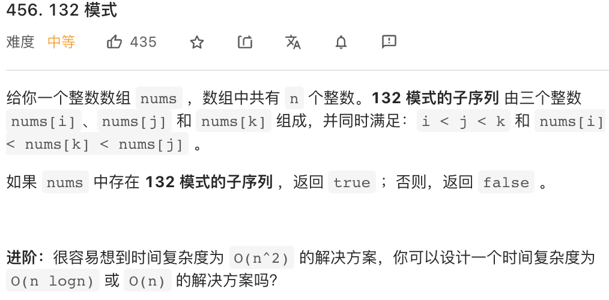

# [456. 132 模式](https://leetcode-cn.com/problems/132-pattern/)




**思路: 枚举最小的数1， 寻找2和3**

**1.单调栈的功能**

利用单调栈，可以实现一个功能：就是在维护栈一个**从大到小**的单调栈的时候， **所有被迫弹出的数一定是遇到了一个比自己大的数才弹出的，并且所有没有被弹出的数一定是因为之后入栈的数中没有比自己大的数所以才留在栈内**（如果有比自己大的数那么这个数会被那个比自己大的数弹出）

例如：

[3, 4, 1, 2]    从左往右入栈

- 2 入栈：【2】

- 1入栈：【2， 1】

- 4要入栈， 因为1比4小，不能维持单调性， 所以1先出栈：【2】， 这意味着1的左边一定有一个比自己大的数

- 4要入栈， 因为2比4小， 不能维持栈内的单调性， 所以2先出栈：【】，这意味着2的左边一定有一个比自己大的数

- 4入栈【4】

- 3要入栈， 符合单调性， 所以直接入栈【4， 3】

**4 ， 3留在栈内， 是因为4， 3的左边没有比自己大的数。**


**2.利用前面单调栈的功能，找到符合条件的2 和 3**

**从左往右遍历1**，假设现在遍历到 `i` 位置， 那么在`[i+1....n - 1]`范围内找 3 和 2 ， **2要在小于3的条件下，尽可能的大**，因为这样才有更大的可能比1大。 维护一个**从大到小**的单调栈，我们可以找到**所有至少有一个数大于自己的数**， **也就是单调栈中被弹出的那些数**，这些可能的数中，**找到那个最大的数k作为2**， 如果 2 大于 1，则返回true。


参考代码

```cpp
class Solution {
public:
    bool find132pattern(vector<int>& nums) {
        stack<int> stk; // 从大到小的单调栈
        int k = INT_MIN; // 单调栈中弹出数中最大的那个
        for(int i = nums.size() - 1; i >= 0; i--){
            if(nums[i] < k){
                return true;
            }
          // 遇到破坏单调性的数， 栈中的数被迫弹出，记录弹出的数中最大的那一个
            while(!stk.empty() && nums[i] > stk.top()){
                k = max(k, stk.top());
                stk.pop();
            }
            stk.push(nums[i]);
        }
        return false;
    }
};
```


参考文章：@宫水三叶【相信科学系列】详解为何使用「单调栈」来找最大的 K 是正确的 ...

https://leetcode-cn.com/problems/132-pattern/solution/xiang-xin-ke-xue-xi-lie-xiang-jie-wei-he-95gt/