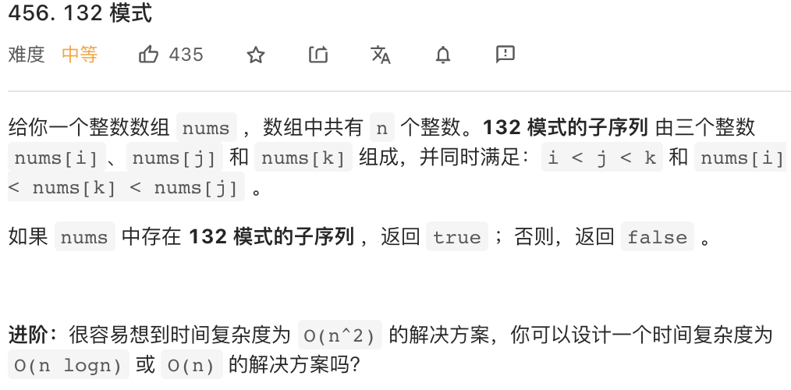
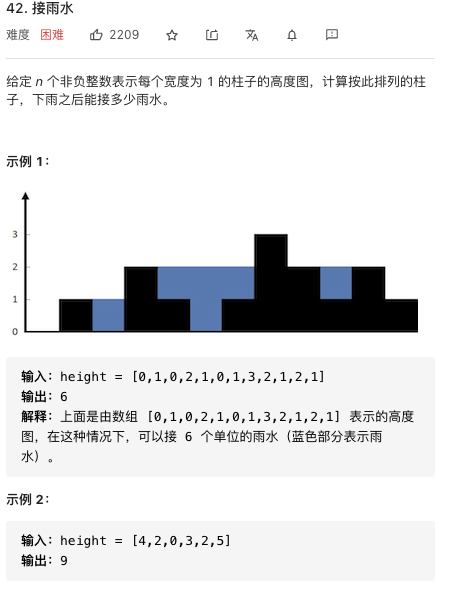
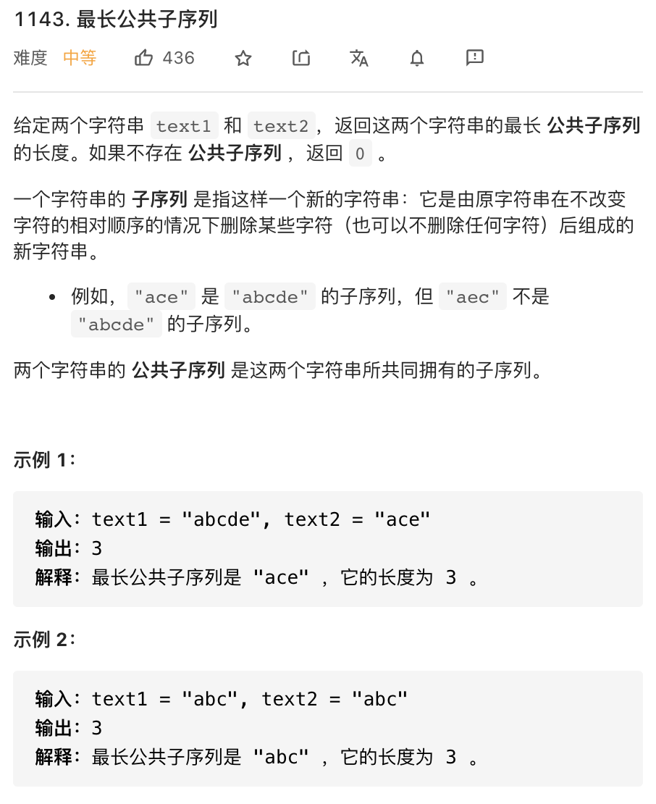

# 单调栈

 ##  [456. 132 模式](https://leetcode-cn.com/problems/132-pattern/)




**思路: 枚举最小的数1， 寻找2和3**

**1.单调栈的功能**

利用单调栈，可以实现一个功能：就是在维护栈一个**从大到小**的单调栈的时候， **所有被迫弹出的数一定是遇到了一个比自己大的数才弹出的，并且所有没有被弹出的数一定是因为之后入栈的数中没有比自己大的数所以才留在栈内**（如果有比自己大的数那么这个数会被那个比自己大的数弹出）

例如：

[3, 4, 1, 2]    从左往右入栈

- 2 入栈：【2】

- 1入栈：【2， 1】

- 4要入栈， 因为1比4小，不能维持单调性， 所以1先出栈：【2】， 这意味着1的左边一定有一个比自己大的数

- 4要入栈， 因为2比4小， 不能维持栈内的单调性， 所以2先出栈：【】，这意味着2的左边一定有一个比自己大的数

- 4入栈【4】

- 3要入栈， 符合单调性， 所以直接入栈【4， 3】

**4 ， 3留在栈内， 是因为4， 3的左边没有比自己大的数。**


**2.利用前面单调栈的功能，找到符合条件的2 和 3**

**从左往右遍历1**，假设现在遍历到 `i` 位置， 那么在`[i+1....n - 1]`范围内找 3 和 2 ， **2要在小于3的条件下，尽可能的大**，因为这样才有更大的可能比1大。 维护一个**从大到小**的单调栈，我们可以找到**所有至少有一个数大于自己的数**， **也就是单调栈中被弹出的那些数**，这些可能的数中，**找到那个最大的数k作为2**， 如果 2 大于 1，则返回true。


参考代码

```cpp
class Solution {
public:
    bool find132pattern(vector<int>& nums) {
        stack<int> stk; // 从大到小的单调栈
        int k = INT_MIN; // 单调栈中弹出数中最大的那个
        for(int i = nums.size() - 1; i >= 0; i--){
            if(nums[i] < k){
                return true;
            }
          // 遇到破坏单调性的数， 栈中的数被迫弹出，记录弹出的数中最大的那一个
            while(!stk.empty() && nums[i] > stk.top()){
                k = max(k, stk.top());
                stk.pop();
            }
            stk.push(nums[i]);
        }
        return false;
    }
};
```


参考文章：@宫水三叶【相信科学系列】详解为何使用「单调栈」来找最大的 K 是正确的 ...

https://leetcode-cn.com/problems/132-pattern/solution/xiang-xin-ke-xue-xi-lie-xiang-jie-wei-he-95gt/


# 双指针

## [42. 接雨水](https://leetcode-cn.com/problems/trapping-rain-water/)



对于位置 i，**i位置能接多少水**，取决于i位置左右两边的最大值中的较小值。

设置如下变量：

```scss
left_max：左边的最大值，它是从左往右遍历找到的
right_max：右边的最大值，它是从右往左遍历找到的
left：从左往右处理的当前下标
right：从右往左处理的当前下标
```

我们从左往右处理到left下标时，左边的最大值left_max对它而言是可信的，但right_max对它而言是不可信的。但是如果left_max < right_max, 那么只要知道left_max，就可以确定left的水量。

```text
                                   right_max
 left_max                             __
   __                                |  |
  |  |__   __??????????????????????  |  |
__|     |__|                       __|  |__
        left                      right
```

同理， 如果left_right_max, 那么只要知道right_max,就可以确定right的水量。

因此， 我们可以交替处理可以处理的那一侧，直到[left, right]中没有位置。

​	

```cpp
class Solution {
public:
    int trap(vector<int>& height) {
        int n = height.size();
        if(n <= 2){
            return 0;
        }
        int leftMax = height[0];
        int rightMax = height[n - 1];
        int left = 1;
        int right = n - 2;
        int ans = 0;
        while(left <= right){
            if(leftMax < rightMax){
              // 如果当前值左边没有比自己大的值，则加0
                ans += max(0, leftMax - height[left]); 
                leftMax = max(leftMax, height[left]);
                left++;
            }else{
              // 如果当前值右边没有比自己大的值，则加0
                ans += max(0, rightMax - height[right]);
                rightMax = max(rightMax, height[right]);
                right--;
            }
        }
        return ans;
    }
};
```


# 动态规划

## [1143. 最长公共子序列](https://leetcode-cn.com/problems/longest-common-subsequence/)



一个序列要和另外一个序列匹配，总是可以分为两种情况

- 当前字符参与最终的答案
- 当前字符不参与最终的答案

对于最长公共子序列的问题， 也是这样一个问题

- 当前字符串1末尾字符和字符串2末尾字符是否匹配，如果可以匹配则匹配（因为最多增加1个字符，能增加就增加）
- 如果不能匹配，则放弃字符串1的末尾字符或放弃字符串2的末尾字符，两个选择中取最大值。


代码：

```cpp
class Solution {
public:
    int longestCommonSubsequence(string text1, string text2) {
        int m = text1.size();
        int n = text2.size();
        int dp[m + 1][n + 1];
        fill(dp[0], dp[m + 1], 0);
        for(int i = 1; i <= m; i++){
            for(int j = 1; j <= n; j++){
                if(text1[i - 1] == text2[j - 1]){// 和最后一个匹配
                    dp[i][j] =  dp[i - 1][j - 1] + 1;
                }else{// 不和最后一个匹配
                    dp[i][j] = max(dp[i][j - 1], dp[i - 1][j]);
                }
            }
        }
        return dp[m][n];
    }
};
```

